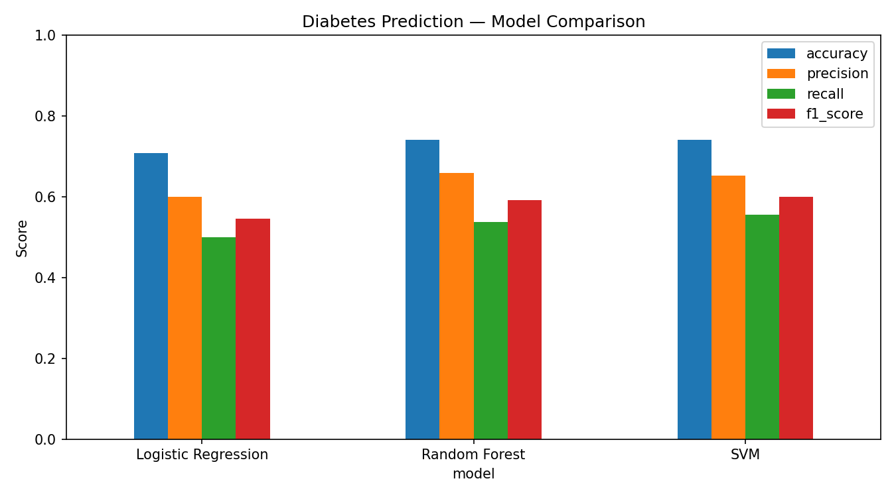
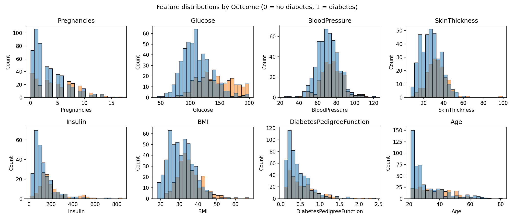

# Disease Prediction from Medical Data (Diabetes)

**CodeAlpha Machine Learning Internship — Task Project**

## Problem
Early detection of diabetes allows earlier treatment and lifestyle changes.
This project builds classification models that predict whether a patient has
**diabetes** from routine medical measurements such as glucose level, blood
pressure, BMI and age.

## Dataset
**Pima Indians Diabetes Dataset**

- 768 patients, 8 medical features + target
- Features: Pregnancies, Glucose, Blood Pressure, Skin Thickness, Insulin,
  BMI, Diabetes Pedigree Function, Age
- Target: `1 = diabetes (268 patients)`, `0 = no diabetes (500 patients)`
- Source: https://raw.githubusercontent.com/jbrownlee/Datasets/master/pima-indians-diabetes.data.csv
- The script downloads the data on first run and caches it at
  `data/pima_diabetes.csv`, so later runs work offline.
- **Data cleaning note:** a value of 0 is physiologically impossible for
  Glucose, Blood Pressure, Skin Thickness, Insulin and BMI, so those zeros
  are treated as missing values and imputed with the median.

## Approach
- Missing-value imputation (median) + standard scaling
- Train / test split: 80 / 20, stratified, `random_state=42`

## Models Used
1. **Logistic Regression** (`max_iter=1000`)
2. **Random Forest Classifier** (300 trees)
3. **Support Vector Machine (SVM)** — RBF kernel

## Results (actual test-set results from running `disease_prediction.py`)
*Precision / recall / F1 below are for the positive class = "diabetes".*

| Model | Accuracy | Precision | Recall | F1-Score |
|---|---|---|---|---|
| Logistic Regression | 0.7078 | 0.6000 | 0.5000 | 0.5455 |
| **Random Forest** | **0.7403** | **0.6591** | 0.5370 | 0.5918 |
| **SVM** | **0.7403** | 0.6522 | **0.5556** | **0.6000** |

**Conclusion:** Random Forest and SVM tied on accuracy (**74.03%**), with SVM
slightly ahead on F1-score (**0.6000**) and recall. Recall for the diabetes
class is the main weakness of all three models (0.50–0.56) — a known
characteristic of this dataset — which matters clinically, because a missed
diabetic patient costs more than a false alarm.

Full metrics: [`outputs/metrics.json`](outputs/metrics.json)

## Output Plots
- Model comparison: `outputs/model_comparison.png`
- Feature distributions by outcome: `outputs/feature_distributions.png`
- Confusion matrices: `outputs/confusion_matrix_logistic_regression.png`,
  `outputs/confusion_matrix_random_forest.png`, `outputs/confusion_matrix_svm.png`




## How to Run
```bash
pip install -r requirements.txt
python disease_prediction.py
```
Results are printed in the terminal and saved to `outputs/` (plots + `metrics.json`).

## Project Structure
```
CodeAlpha_DiseasePrediction/
├── disease_prediction.py
├── requirements.txt
├── README.md
├── data/
│   └── pima_diabetes.csv        (cached after first run)
└── outputs/
    ├── metrics.json
    ├── model_comparison.png
    ├── feature_distributions.png
    ├── confusion_matrix_logistic_regression.png
    ├── confusion_matrix_random_forest.png
    └── confusion_matrix_svm.png
```

> ⚠️ Educational project only — not a medical diagnostic tool.

---
**Author: Muhammad Abdul Rafay — CodeAlpha ML Intern**
